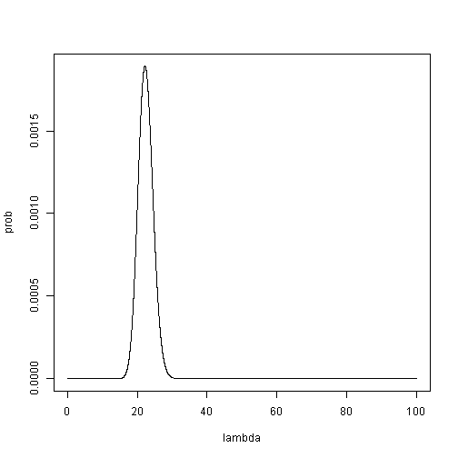
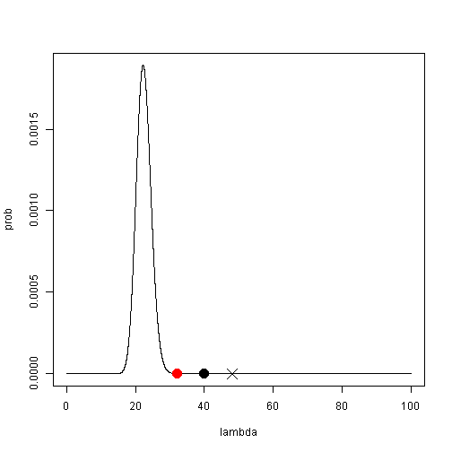
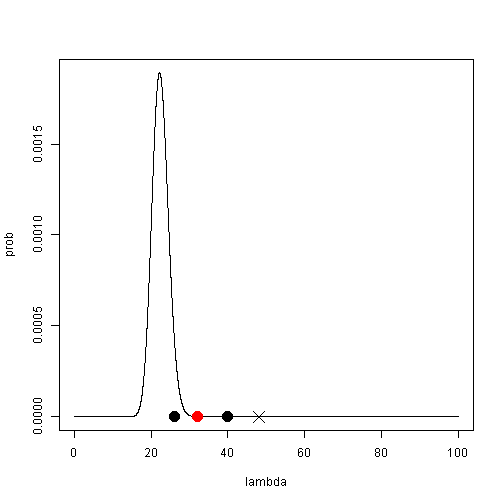
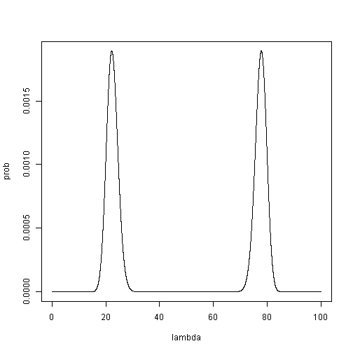
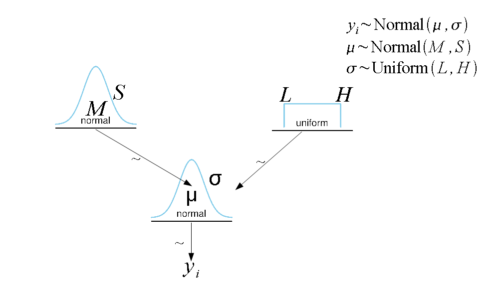
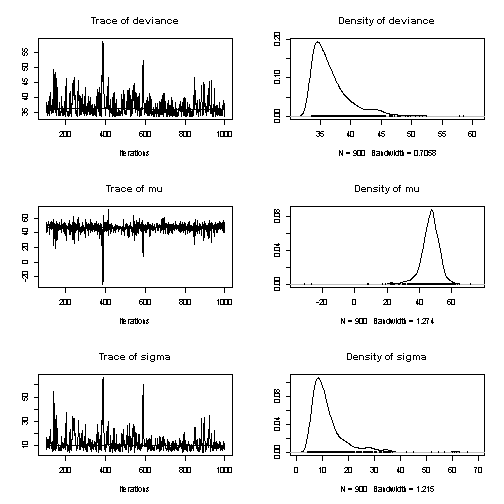

Doing it Bayesian
========================================================
author: Jan Smycka, Petr Keil
date: 

Conditional probability
========================================================
Rule for joint (AND) probability is
$$P(A \cap B) = P(A) \times P(B|A)$$
$A$ and $B$ can be swapped arbitrarily
$$P(A \cap B) = P(B) \times P(A|B)$$
and so
$$P(B) \times P(A|B) = P(A) \times P(B|A)$$
which we can rearrange to get
$$P(A|B) = \frac {P(B|A) \times P(A)}{P(B)}$$
which is **the Bayes rule**.

Conditional probability
========================================================
We can also say that
$$P(B)=P(B|A) \times P(A)+P(B|nonA) \times P(nonA)$$
so
$$P(A|B) =\frac {P(B|A) \times P(A)}{P(B)}$$

$$=\frac {P(B|A) \times P(A)}{P(B|A) \times P(A)+P(B|nonA) \times P(nonA)}$$

if we use sum sign
$$P(A|B)=\frac {P(B|A) \times P(A)}{\sum_A P(B|A) \times P(A)}$$

Bayes rule in statistics
========================================================
we can replace $A$ and $B$ by model parameters $\theta$ and the data $y$ to get 

$p(\theta|y) = \frac {p(\theta) \times p(y|\theta)}{p(y)}$

where

$p(y|\theta)$ ... likelihood

$p(\theta)$ ... prior

$p(\theta|y)$ ... posterior

$p(y)$ ... the horrible thing

Why is p(y) horrible?
========================================================
$$p(y)=\sum_\theta p(\theta) \times p(y|\theta)$$

$$p(y)=\int_\theta p(\theta) \times p(y|\theta) d\theta$$

The data
========================================================
We have five data points from poisson distribution

```r
x=rpois(5,20)
x
```

```
[1] 27 30 15 22 22
```
 
 
We would like to know posterior distribution of $\lambda$

Analytical solution
========================================================

Poisson distribution posterior can be expressed as

$$p(\lambda|x)=\dfrac{p(x|\lambda)*p(\lambda)}{p(x)}$$

where

$$p(x|\lambda)=\prod\limits_{i=1}^n \dfrac{\lambda^{x_i}e^{-\lambda}}{x_i!}; p(\lambda)=0.01\\$$


$$p(x)=\int_\lambda (\prod\limits_{i=1}^n \dfrac{\lambda^{x_i}e^{-\lambda}}{x_i!}*0.01)  d\lambda\\ $$


Analytical solution - properties
========================================================
 
 - is accurate
 
 
 
 - cannot be obtained for most model types
 

Numerical computation
========================================================
We can try to compute numerically

The numerator can be expressed as R function

```r
baypo=function(l){
  #likelihood
  lh=function(l){
    prod(((l^x)*exp(-l))/factorial(x))
  }
  #likelihood and prior
  100000000*lh(l)*dunif(l,0,100)
  }
```


Numerical computation
========================================================

Now we can generate a grid and feed the function

```r
lambda=seq(0,100,0.01)
postdist=NULL
for (i in 1:length(lambda)){
  postdist[i]=baypo(lambda[i])
  }
prob=postdist/sum(postdist)
```


Numerical computation
========================================================
 

Numerical computation - properties
========================================================
 - theoretically works always
 
 - can be paralelized on clusters
 
 - is terribly slow and wasteful
 

Metropolis - Hastings
========================================================
So what about more clever ways of sampling?

 

Metropolis - Hastings
========================================================
If we want to know where the modus is

 

Metropolis - Hastings
========================================================
If we want to know where the modus is


 

Metropolis - Hastings
========================================================
If we want to know where the modus is


 

Metropolis - Hastings
========================================================
If we want to know where the modus is


 
Metropolis - Hastings
========================================================
If we want to know where the modus is


 

Metropolis - Hastings
========================================================
If we want to know where the modus is


 

Metropolis - Hastings
========================================================
If we want to know where the modus is, we accept each $\lambda_n$ which satisfies

$$\frac{p(\lambda_n|y) }{ p(\lambda_o|y)}=\frac{p(x|\lambda_n)*p(\lambda_n) }{ p(x|\lambda_o)*p(\lambda_o)}>1$$

Metropolis - Hastings
========================================================
If we want to hit each value of $\lambda$ with probability $p(\lambda|y)$, we accept each $\lambda_n$

$$\frac{p(\lambda_n|y) }{ p(\lambda_o|y)}=\frac{p(x|\lambda_n)*p(\lambda_n) }{ p(x|\lambda_o)*p(\lambda_o)}>1$$

with probablity 1, and


$$\frac{p(\lambda_n|y) }{ p(\lambda_o|y)}=\frac{p(x|\lambda_n)*p(\lambda_n) }{ p(x|\lambda_o)*p(\lambda_o)}<1$$

with probability $\frac{p(\lambda_n|y) }{ p(\lambda_o|y)}$


Metropolis - Hastings
========================================================
And now switch to "histogram thinking"
 

Metropolis - Hastings - properties
========================================================
 - is more efficient than numerical integration
 
 - problem with camels
 
 - need to set up the jumps
 
 - can be slow if we have many variables
 
Metropolis - Hastings
========================================================
 

Metropolis - Hastings - properties
========================================================
 - samples from the beginning do not reflect the distribution
 
 - correlation between subsequent steps


Gibbs
========================================================
Lets imagine we have more variables than one. For example data from normal distribution and we want to estimate distribution of $\mu$ and $\sigma$.

$$p(\mu, \sigma|y)=\dfrac{p(y|\mu, \sigma)*p(\mu)*p(\sigma)}{p(y)}$$

Gibbs
========================================================
 

Gibbs
========================================================
Sampling from univariate distribution is always quite simple.

If we knew $\sigma$ we could sample $\mu$ from $p(\mu|\sigma,y)$

If we knew $\mu$ we could sample $\sigma$ from $p(\sigma|\mu,y)$


Gibbs
========================================================
Yes, if sampling from univariate is simple, we didn't have to do it by M-H in previous chapter. But M-H can be easily generalized to more dimension unlike direct sampling.

Gibbs
========================================================
 

Gibbs
========================================================
 

Gibbs
========================================================
 

Gibbs
========================================================
 
Gibbs
========================================================
 
Gibbs
========================================================
 

Gibbs
========================================================

Get initial values of $\mu$ and $\sigma$.

Take initial $\sigma$ and sample $\mu$ from $p(\mu|\sigma,y)$

Take sampled $\mu$ and sample $\sigma$ from $p(\sigma|\mu,y)$

Repeat


Gibbs - properties
========================================================
 - for many parameters is more efficient than numerical integration and M-H

 - problem with camels
 
 - problem with cigars
 
Gibbs - properties
========================================================
 

Gibbs - properties
========================================================
 - samples from the beginning do not reflect the distribution
 
 - correlation between subsequent steps


MCMC
========================================================


BUGS language
========================================================
There is a plenty of environments that can do Gibbs sampling for you

 - WinBUGS
 - OpenBUGS [www.openbugs.net](http://openbugs.net/w/FrontPage)
 - **JAGS** [mcmc-jags.sourceforge.net/](http://mcmc-jags.sourceforge.net/)

... and all those use BUGS language

JAGS
========================================================

```r
y <- rnorm(5, 48.1, 6.1^2)
N <- 5

my.data <- list(y=y, N=N)
my.data
```

```
$y
[1] -26.26397  45.94571  40.74765  32.04463  48.32490

$N
[1] 5
```

JAGS
========================================================
BUGS language works with graphs




JAGS
========================================================

```
model
{
  # p(mu) ... mu prior
    mu ~ dnorm (0, 0.001)
    
  # p(sigma) ... sigma prior
    sigma ~ dunif(0, 100)
    
  # p(y|mu, sigma) ... likelihood
    for(i in 1:N)
    {
      y[i] ~ dnorm(mu, sigma)    
    }
}
```

JAGS
========================================================
We will dump the model to a file using ```cat("", file="")```


```r
cat("
model
{
  # priors
    mu ~ dnorm (0, 0.001)
    sigma ~ dunif(0, 100)
  # likelihood
    for(i in 1:N)
    {
      y[i] ~ dnorm(mu, sigma)    
    }
}
", file="my_model.txt")
```

JAGS
========================================================

```r
library(R2jags)

fitted.model <- jags(data=my.data,  model.file="my_model.txt", parameters.to.save=c("mu", "sigma"), n.chains=1, n.iter=300, n.burnin=100)
```

```
Compiling model graph
   Resolving undeclared variables
   Allocating nodes
   Graph Size: 11

Initializing model
```

JAGS
========================================================
 


STAN - properties
=======================================================
[mc-stan.org](mc-stan.org)
 
 - uses more sophisticated MCMC sampling than Gibbs or M-H
 
 - suffers less from steps autocorrelation
 
 - may be more efficient for complicated posteriors (cigars, camels)
 
 - language is more difficult to command then BUGS


INLA
========================================================
(Integrated Nested Laplace Approximation)

[www.r-inla.org](www.r-inla.org)

Uses the idea that in certain types of models $p(some_parameters|other_parameters,data)$ can be aproximated by normal distribution.

This makes the expression $p(data|parameters)*p(parameters)$ integrable.


INLA
========================================================

 

INLA - properties
========================================================
 - fast
 
 - does not suffer from sampling issues
 
 - applicable only to some classes of models (for details see [http://www.r-inla.org/models/latent-models](http://www.r-inla.org/models/latent-models))
